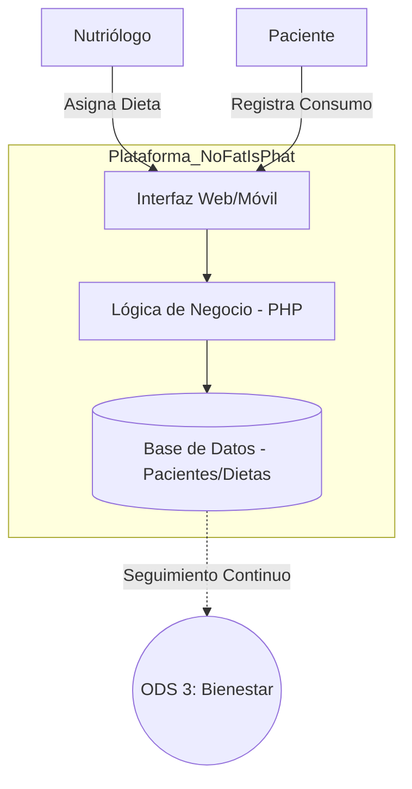

# Sistema de Registro de Estudiantes

Bienvenido a la documentación técnica del Sistema NoFatIsPhat.

## Vista de Contexto (C4 Nivel 1)

## Secciones

### Diccionario de datos

<https://deadgon48.github.io/NoFatIsPhat-frontend/datos>

### Guía de Despliegue

<https://deadgon48.github.io/NoFatIsPhat-frontend/despliege>
